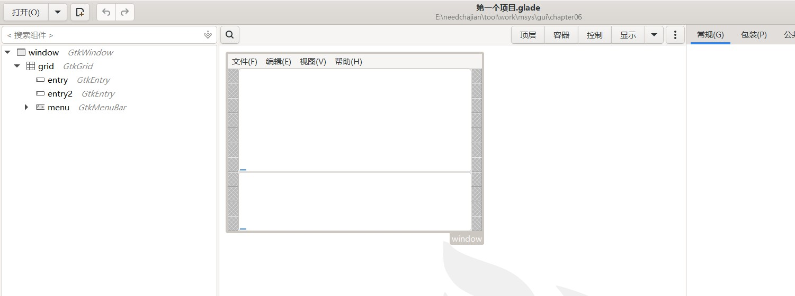

如果一直写代码我也觉得很累，我们可以使用gtk + glade来进行开发；  
配置号环境后在cmd中输入glade即可打开开发。  
可惜网上教程是英文的，难受  
真的比纯手写代码舒服多了。但是也仅仅是gui部分而已，所以前面基础内容要学。  
glade你可以随意开发比如  

在gtk三中glade貌似变成了gladeui，里面也有一些函数改变了  
所以我是用GtkBuilder来获取.glade的内容进行开发